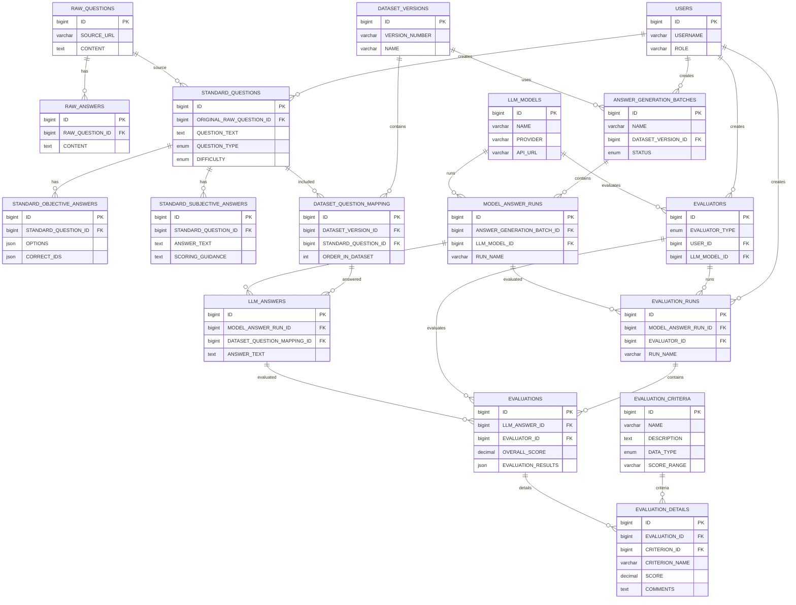
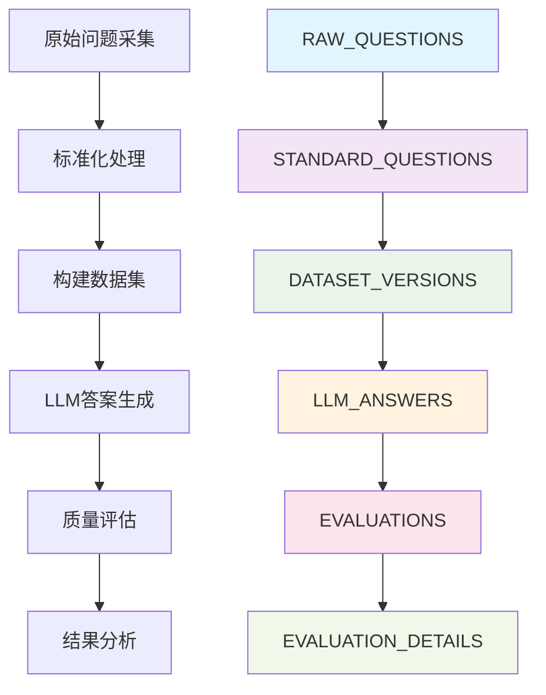

# 智能问答系统数据库ER图 - 简化版

## 核心表关系图

```mermaid
erDiagram
    %% 用户管理
    USERS {
        bigint ID PK
        varchar USERNAME
        varchar ROLE
    }

    %% 原始数据
    RAW_QUESTIONS {
        bigint ID PK
        varchar SOURCE_URL
        text CONTENT
    }

    RAW_ANSWERS {
        bigint ID PK
        bigint RAW_QUESTION_ID FK
        text CONTENT
    }

    %% 标准问题
    STANDARD_QUESTIONS {
        bigint ID PK
        bigint ORIGINAL_RAW_QUESTION_ID FK
        text QUESTION_TEXT
        enum QUESTION_TYPE
        enum DIFFICULTY
    }

    %% 标准答案
    STANDARD_OBJECTIVE_ANSWERS {
        bigint ID PK
        bigint STANDARD_QUESTION_ID FK
        json OPTIONS
        json CORRECT_IDS
    }

    STANDARD_SUBJECTIVE_ANSWERS {
        bigint ID PK
        bigint STANDARD_QUESTION_ID FK
        text ANSWER_TEXT
        text SCORING_GUIDANCE
    }

    %% 数据集
    DATASET_VERSIONS {
        bigint ID PK
        varchar VERSION_NUMBER
        varchar NAME
    }

    DATASET_QUESTION_MAPPING {
        bigint ID PK
        bigint DATASET_VERSION_ID FK
        bigint STANDARD_QUESTION_ID FK
        int ORDER_IN_DATASET
    }

    %% LLM模型
    LLM_MODELS {
        bigint ID PK
        varchar NAME
        varchar PROVIDER
        varchar API_URL
    }

    %% 答案生成
    ANSWER_GENERATION_BATCHES {
        bigint ID PK
        varchar NAME
        bigint DATASET_VERSION_ID FK
        enum STATUS
    }

    MODEL_ANSWER_RUNS {
        bigint ID PK
        bigint ANSWER_GENERATION_BATCH_ID FK
        bigint LLM_MODEL_ID FK
        varchar RUN_NAME
    }

    LLM_ANSWERS {
        bigint ID PK
        bigint MODEL_ANSWER_RUN_ID FK
        bigint DATASET_QUESTION_MAPPING_ID FK
        text ANSWER_TEXT
    }

    %% 评估系统
    EVALUATION_CRITERIA {
        bigint ID PK
        varchar NAME
        text DESCRIPTION
        enum DATA_TYPE
        varchar SCORE_RANGE
    }

    EVALUATORS {
        bigint ID PK
        enum EVALUATOR_TYPE
        bigint USER_ID FK
        bigint LLM_MODEL_ID FK
    }

    EVALUATION_RUNS {
        bigint ID PK
        bigint MODEL_ANSWER_RUN_ID FK
        bigint EVALUATOR_ID FK
        varchar RUN_NAME
    }

    EVALUATIONS {
        bigint ID PK
        bigint LLM_ANSWER_ID FK
        bigint EVALUATOR_ID FK
        decimal OVERALL_SCORE
        json EVALUATION_RESULTS
    }

    EVALUATION_DETAILS {
        bigint ID PK
        bigint EVALUATION_ID FK
        bigint CRITERION_ID FK
        varchar CRITERION_NAME
        decimal SCORE
        text COMMENTS
    }

    %% 关系定义
    RAW_QUESTIONS ||--o{ RAW_ANSWERS : "has"
    RAW_QUESTIONS ||--o{ STANDARD_QUESTIONS : "source"
    
    STANDARD_QUESTIONS ||--o{ STANDARD_OBJECTIVE_ANSWERS : "has"
    STANDARD_QUESTIONS ||--o{ STANDARD_SUBJECTIVE_ANSWERS : "has"
    STANDARD_QUESTIONS ||--o{ DATASET_QUESTION_MAPPING : "included"
    
    DATASET_VERSIONS ||--o{ DATASET_QUESTION_MAPPING : "contains"
    DATASET_VERSIONS ||--o{ ANSWER_GENERATION_BATCHES : "uses"
    
    LLM_MODELS ||--o{ MODEL_ANSWER_RUNS : "runs"
    LLM_MODELS ||--o{ EVALUATORS : "evaluates"
    
    ANSWER_GENERATION_BATCHES ||--o{ MODEL_ANSWER_RUNS : "contains"
    MODEL_ANSWER_RUNS ||--o{ LLM_ANSWERS : "generates"
    MODEL_ANSWER_RUNS ||--o{ EVALUATION_RUNS : "evaluated"
    
    DATASET_QUESTION_MAPPING ||--o{ LLM_ANSWERS : "answered"
    
    LLM_ANSWERS ||--o{ EVALUATIONS : "evaluated"
    
    EVALUATORS ||--o{ EVALUATION_RUNS : "runs"
    EVALUATORS ||--o{ EVALUATIONS : "evaluates"
    
    EVALUATION_RUNS ||--o{ EVALUATIONS : "contains"
    EVALUATIONS ||--o{ EVALUATION_DETAILS : "details"
    
    EVALUATION_CRITERIA ||--o{ EVALUATION_DETAILS : "criteria"
    
    USERS ||--o{ STANDARD_QUESTIONS : "creates"
    USERS ||--o{ ANSWER_GENERATION_BATCHES : "creates"
    USERS ||--o{ EVALUATION_RUNS : "creates"
    USERS ||--o{ EVALUATORS : "creates"
```

## 数据流程图

```mermaid
flowchart TD
    A[原始问题采集] --> B[标准化处理]
    B --> C[构建数据集]
    C --> D[LLM答案生成]
    D --> E[质量评估]
    E --> F[结果分析]
    
    A1[RAW_QUESTIONS] --> B1[STANDARD_QUESTIONS]
    B1 --> C1[DATASET_VERSIONS]
    C1 --> D1[LLM_ANSWERS]
    D1 --> E1[EVALUATIONS]
    E1 --> F1[EVALUATION_DETAILS]
    
    style A1 fill:#e1f5fe
    style B1 fill:#f3e5f5
    style C1 fill:#e8f5e8
    style D1 fill:#fff3e0
    style E1 fill:#fce4ec
    style F1 fill:#f1f8e9
``` 